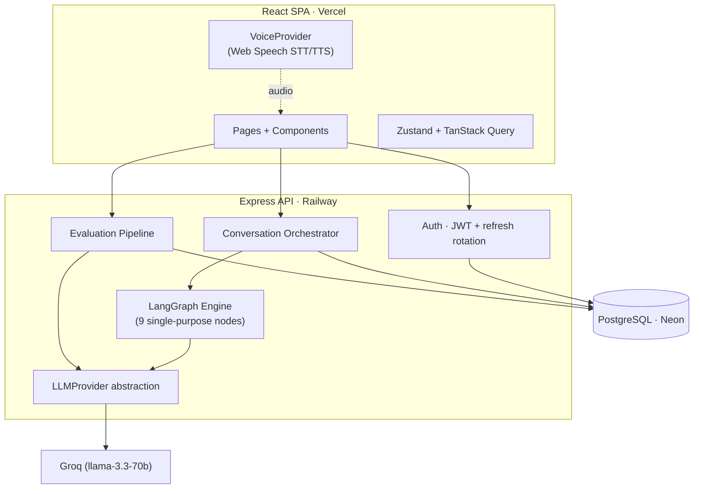
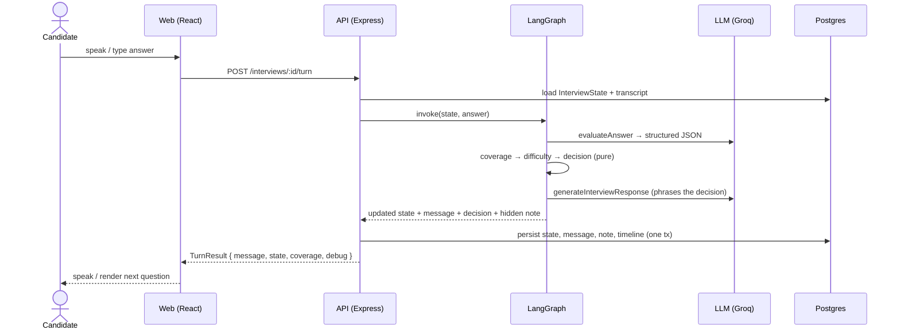

# Cadence

**A voice-first AI mock interview platform that reasons about the conversation before deciding what to say.**

Cadence feels like talking to a real interviewer — not ChatGPT with a microphone. Every question is chosen by a stateful engine that evaluates your answer, tracks topic coverage, adjusts difficulty, and decides its next move — then a language model only *phrases* that decision naturally. When the interview ends, you get a hiring-panel-grade evaluation with scores, a recommendation, a transparent timeline, and a learning roadmap.

> **Demo login** (after `pnpm db:seed`): `demo@cadence.app` / `Demo1234!` — lands on a populated dashboard with two evaluated interviews and one ready to start.

---

## Problem statement

Generic "AI interview" tools prompt an LLM with the chat history and ask it to "be an interviewer." The result drifts, repeats itself, never adapts difficulty, and can't explain *why* it asked anything. Cadence treats the interview as a **state machine the model serves**, not a transcript the model rambles over:

- **State-driven, not prompt-driven** — the prompt is built from a structured `InterviewState`, never from raw messages.
- **The decision is deterministic; the phrasing is the model's** — a pure policy picks the next action (follow-up, challenge, move on, raise difficulty…) *and the reason*, then the LLM renders it in natural language.
- **Explainable** — every question stores the reasoning behind it, surfaced in a debug panel and in the final report.
- **Provider- and voice-agnostic** — swap the LLM or the voice engine behind an interface without touching the app.

---

## Architecture

Clear layers, one responsibility each:

```text
Presentation (React SPA)
        │
   API layer (Express, JWT, Zod)
        │
Conversation orchestrator ── Evaluation pipeline
        │                          │
  LangGraph engine           Report / Timeline / LearningPlan services
        │                          │
  LLMProvider abstraction ─────────┘
        │
   PostgreSQL (Prisma)
```



### Sequence — one interview turn



### Data model (ER)

```mermaid
erDiagram
  User ||--o| Profile : has
  User ||--o{ RefreshToken : has
  User ||--o{ Interview : owns
  Interview ||--|| InterviewState : has
  Interview ||--o{ Message : transcript
  Interview ||--o{ InterviewNote : "hidden AI notes"
  Interview ||--o{ TimelineEvent : timeline
  Interview ||--o| Evaluation : "generated once"

  User { string id PK; string email UK; string passwordHash; string fullName }
  Profile { string userId FK; string targetRole; enum experienceLevel; int yearsExperience; enum preferredType; string[] focusSkills }
  Interview { string id PK; string userId FK; enum interviewType; enum personality; int difficulty; int baseDifficulty; enum status }
  InterviewState { string interviewId FK; enum currentStage; string[] coveredTopics; string[] remainingTopics; json scoreHistory; json signals }
  Evaluation { string interviewId FK; int overallScore; string recommendation; json report }
```

---

## Why these choices

**Why LangGraph.** The interview is a branching, stateful workflow — opening vs. answer-processing paths, one node per concern (transcript → analyze → coverage → difficulty → decision → memory → compose → respond). LangGraph models that as a graph with conditional edges and a typed state channel, so each node is small, pure, and independently testable, and the control flow is explicit rather than buried in one mega-prompt.

**Why `InterviewState`.** Feeding raw chat history to an LLM makes it forget *where* the conversation is. A structured state (stage, objective, covered/remaining topics, running scores, competency signals, difficulty, follow-up history) lets the engine reason about position and progress, keeps the prompt bounded as the interview grows, and becomes the evidence the final report is built from.

**Why a provider abstraction.** `LLMProvider` and `VoiceProvider` are interfaces. The app depends only on them, so Groq → Gemini/OpenAI, or browser voice → a managed voice service, is a one-line/config change. A deterministic **mock** provider makes the entire engine testable offline with zero API keys — which is how the whole thing is verified in CI.

**Why PostgreSQL.** Relational integrity for users/interviews/evaluations, plus `JSONB` columns for the fast-evolving state collections (signals, score history) so the schema can grow without migrations. Neon gives a serverless Postgres that fits a free-tier deploy.

**Why JWT (access + refresh).** A short-lived access token in memory (never `localStorage`, so XSS can't read it) + a long-lived, hashed, httpOnly refresh cookie with rotation and reuse detection. Stateless auth on the hot path, revocable sessions where it matters.

---

## Tech stack

| Layer | Choice |
|---|---|
| Frontend | React, Vite, React Router, TailwindCSS, Framer Motion, Zustand, TanStack Query |
| Backend | Node, Express, Prisma, PostgreSQL, JWT, Zod |
| AI | LangGraph (orchestration), Groq `llama-3.3-70b-versatile` (default), provider-abstracted |
| Voice | Browser Web Speech API (STT + TTS), abstracted for a managed provider |
| Deploy | Vercel (web) · Railway (api) · Neon (Postgres) |

---

## Quick start (< 5 commands)

```bash
pnpm install
cp apps/api/.env.example apps/api/.env      # set DATABASE_URL + JWT secrets (openssl rand -base64 48)
cp apps/web/.env.example apps/web/.env
pnpm --filter @cadence/api db:migrate && pnpm db:seed
pnpm dev                                     # web :5173 · api :4000
```

Need Postgres fast? `docker run -d --name cadence-pg -e POSTGRES_PASSWORD=postgres -e POSTGRES_DB=cadence -p 5432:5432 postgres:16-alpine`

**No Groq key?** In development the API auto-falls back to the deterministic mock provider, so the full flow works offline. Set `GROQ_API_KEY` + `LLM_PROVIDER=groq` for real model responses (free tier at console.groq.com).

---

## Folder structure

```text
cadence/
├─ apps/
│  ├─ api/                      Express + Prisma + LangGraph
│  │  ├─ prisma/                schema, migrations, seed
│  │  └─ src/
│  │     ├─ engine/             LangGraph: nodes/, policies/, graph.ts, engine.state.ts
│  │     ├─ prompts/            model-agnostic prompt builders
│  │     ├─ providers/llm/      LLMProvider + groq/mock/gemini/openai
│  │     ├─ modules/            auth · users · profile · interview · interviewState
│  │     │                      · coverage · conversation · evaluation · timeline
│  │     ├─ middleware/         requireAuth · rateLimit · error · validate
│  │     └─ lib/                prisma · jwt · cookies · http · logger
│  └─ web/
│     └─ src/
│        ├─ pages/              route-split screens
│        ├─ features/           auth · profile · interview · conversation · voice · report · toast
│        ├─ components/         ui/ · interview/ · charts/ · report/
│        └─ hooks/              useZodForm · useElapsed · useKeyboardShortcuts
└─ packages/types/             shared contracts (InterviewState, DTOs, Zod schemas)
```

---

## API overview

All under `/api/v1`, JSON envelope `{ ok, data | error }`, owner-scoped, JWT-gated except auth + health.

| Area | Endpoints |
|---|---|
| Health | `GET /health` · `GET /version` |
| Auth | `POST /auth/register` · `/login` · `/refresh` · `/logout` · `GET /auth/me` |
| Profile | `GET /profile` · `PUT /profile` |
| Interviews | `POST /interviews` · `GET /interviews` · `GET /interviews/:id` · `GET /interviews/:id/coverage` · `GET /interviews/dashboard` |
| Conversation | `GET /interviews/:id/conversation` · `POST /interviews/:id/start` · `/turn` · `/end` · `/restart` |
| Report | `GET /interviews/:id/report` (generated once, then cached) |

---

## Environment variables

**`apps/api/.env`**

| Var | Purpose |
|---|---|
| `NODE_ENV` | `development` \| `production` |
| `PORT` | API port (default 4000) |
| `CORS_ORIGIN` | Comma-separated allowed web origins |
| `DATABASE_URL` | Postgres connection (Neon in prod) |
| `JWT_ACCESS_SECRET` / `JWT_REFRESH_SECRET` | ≥ 32 chars; `openssl rand -base64 48` |
| `ACCESS_TOKEN_TTL` / `REFRESH_TOKEN_TTL_DAYS` | Token lifetimes (defaults `15m` / `30`) |
| `COOKIE_DOMAIN` | Optional prod cookie domain |
| `LLM_PROVIDER` | `groq` (default) \| `gemini` \| `openai` \| `mock` |
| `LLM_MODEL` | e.g. `llama-3.3-70b-versatile` |
| `GROQ_API_KEY` | Required in production when provider is `groq` |

**`apps/web/.env`**

| Var | Purpose |
|---|---|
| `VITE_API_URL` | API base URL |
| `VITE_DEBUG_AI` | `true` shows the in-room AI debug panel |

---

## Deployment

**Database — Neon:** create a project, copy the pooled connection string into the API's `DATABASE_URL`.

**API — Railway:** point at `apps/api`, set env vars, build `pnpm install && pnpm --filter @cadence/api build`, start via the `Procfile` (`start:prod` runs `prisma migrate deploy` then the server). Set `CORS_ORIGIN` to the Vercel URL and `NODE_ENV=production`.

**Web — Vercel:** import the repo, root `apps/web` (config in `vercel.json`), set `VITE_API_URL` to the Railway URL. SPA rewrites and long-cache asset headers are pre-configured.

> Deploying requires your own Vercel/Railway/Neon accounts; the config and docs here are production-ready, and the production build is verified locally (`pnpm build`).

---

## Screens

The key surfaces (add screenshots to `docs/screens/` for the hosted README):
Landing · Register/Login · Complete Profile · Dashboard (score trend + skills radar) · Interview setup wizard · **Interview room** (waveform, live captions, phase states, debug panel) · **Report** (score ring, radar, hiring verdict, timeline, learning roadmap).

---

## Trade-offs

- **Browser Web Speech over a paid voice service** — zero cost and no keys for development; quality/turn-taking is browser-dependent. The `VoiceProvider` interface makes a managed provider a drop-in upgrade.
- **Deterministic decision policy over an LLM "router"** — cheaper, testable, and explainable, at the cost of some flexibility. The LLM handles what it's good at (evaluation, phrasing).
- **Turn-based engine over streaming** — simpler, atomic persistence per turn, and a clean seam for voice; not token-streaming the reply.
- **In-memory rate-limit store** — fine for a single instance; swap for Redis to scale horizontally.

## Known limitations

- Voice I/O needs a Chromium-based browser with mic permission; text mode is the universal fallback.
- Report PDF export uses the browser's print-to-PDF (with a dedicated light print stylesheet) rather than server-rendered PDF.
- Pause is client-side; elapsed time is computed from the server `startedAt`.

## Future improvements

- Managed voice provider (ElevenLabs) behind the existing `VoiceProvider`.
- Streaming interviewer responses for lower perceived latency.
- Multi-round interview loops and role-specific question banks.
- Vendor-chunk splitting and a Redis-backed rate limiter for scale.

---

Built as a milestone-by-milestone project: foundation → auth → interview state → LangGraph engine → voice → evaluation → production hardening.
